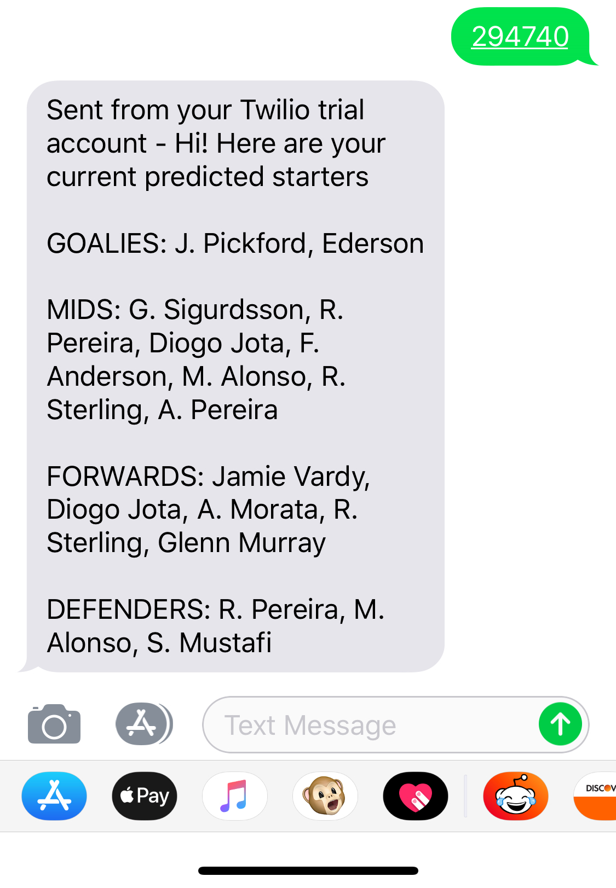

# PLStarters
  I got convinced to join a fantasy Premier League draft team, having never followed the Premier League before. Determined to win with minimal effort, I started this short project.

### The Gist:
  Every person has a unique team identifier within their league. This number can be found in the URL when you have the site open. Texting this team number will yield a response with everyone from your draft team set to start the upcoming week based on data and predictions from www.rotowire.com/soccer/lineups.php. 
  

### Functionality
  The code for this project is hosted on a Heroku server. The bot's functionality works through Twilio. When someone texts a recognized league identifier, a list of all your players are created. The names in this list are compared with the predicted starters of all Premier League teams. Matching names are sorted by position and texted back to the sender.
 
